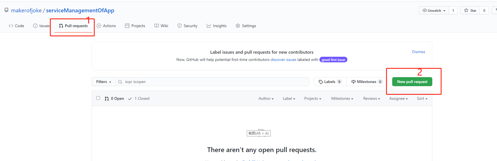

# 服务组的开发文档
## documents
包含了服务组模块的设计文档
## log

服务组开发日程记录

## download

1.本地安装和配置git环境

2.将项目fork到自己的域名下

3.找到放置本地仓库文件的位置，打开gitbash

4.git clone复制自己fork的项目到本地

```
# git clone + 项目ssh链接
```

## fetch update

1.具体参考https://www.jianshu.com/p/840ea273f25a

# push update

1.添加本地修改

```
# git add .(.代表所有修改的文件，也可以只提交部分修改的文件)
```

2.提交到本地仓库

```
# git commit -m "详细注释本次提交的内容"
```

3.push到自己fork的项目

```
# git push
```

4.提交merge请求到原项目

